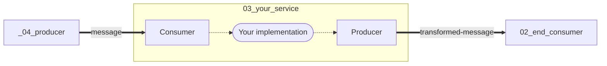

# Kafka-based service for tweets

In this file, you will have to run 3 services bsed on Kafka. You will
have to process the tweets one by one through a series of exercices in
the file `03_your_service`.

## Description
Here is the architecture of the services in this file:



* **_04_producer** is an application that generates messages on the
  "message" topic based on the content of
  `data/twitter/tweets.json.gz`.
* **_03_your_service** is a service that polls data from the topic
  "message", transforms them, and sends them in the topic
  "transformed-message".
* **_02_end_consumer** is an application that display new messages in
  the topic "transformed-message". 

### Messages send by the producer

It sends the content of the tweet in the topic. The user screen name is
used a key. The message value is a JSON document that looks like:

```json
{"user": "Jon", "text": "Say something", "lang": "en"}
```

## Run the exercises

First, execute `_01_init.main` only once to create necessary
topics.

Modify one exercise in `_03_your_service.services`, one
at a time. Then modify `_03_your_service.main` to select
one of the exercise from `_03_your_service.services`.
Then:
1. Execute `_02_end_consumer.main`
2. Execute `_03_your_service.main`
3. Execute `_04_producer.main`
   
If something is not satisfying or if you have finished an exercise,
then stop `_03_your_service.main` and fix the problem or
go to the next exercise.

Repeat until all the exercise are done.

Note: if your service uses a database, you can check its content in
your browser with this URL: http://localhost:18080/data/
