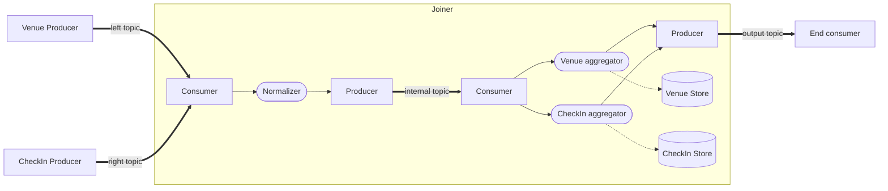

# Join

```mermaid
flowchart LR
  producer1[Venue Producer]
  producer2[CheckIn Producer]
  consumer1[Consumer]
  inproducer1[Producer]
  normalizer([Normalizer])
  consumer2[Consumer]
  inproducer2[Producer]
  leftagg([Venue aggregator])
  rightagg([CheckIn aggregator])
  leftstore[(Venue Store)]
  rightstore[(CheckIn Store)]
  endconsumer[End consumer]
  
  producer1 == left topic ==> consumer1
  producer2 == right topic ==> consumer1
  inproducer2 == output topic ==> endconsumer
  
  subgraph joiner [Joiner]
    consumer1 --> normalizer --> inproducer1
    inproducer1 == internal topic ==> consumer2
    consumer2 --> leftagg
    consumer2 --> rightagg
    leftagg --> inproducer2
    rightagg --> inproducer2
    leftagg -.-> leftstore
    rightagg -.-> rightstore
  end
```