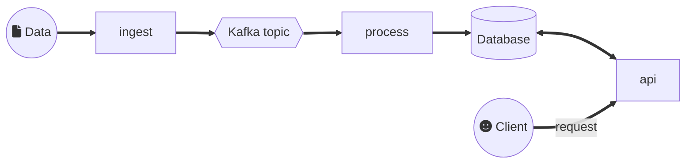

# Architecture

The whole application is based on the microservice architecture
approach.

## About microservice architecture

Microservice architecture aims to build complex applications with
guarantee in terms of resiliency and scalability.

Naturally, to bring complexity in an application is a nonsense.
Here, the application is complex, because it is divided into 3
separated and independent services, and it has a database and a queue.
Each of those items as a specific process in terms of delivery. You
have to monitor them all to check if they are always up. And the
services need to be synchronised not only at runtime, but also during
the development phase, because you have to ensure that the
communication will not fail and that they share the same data model.

The compromise here is that if one of those items or services fails
(ie. the application partially fails), the rest of application continue
to run. And you can multiply the count of each item at delivery-time or
at runtime to increase the overall performance of the application (ie.
scalability).

Notice that a microservice architecture might is not always the best
solution to ensure high availability from a service. As an example,
during Covid-19 vaccination campaign in early summer of 2021, the
Doctolib website were simply using a monolithic service, based on Ruby
on Rails and PostgreSQL, to manage a huge quantity of appointments —an
architecture that they called _the boring architecture_.

## Application architecture

The application is divided into 3 services:

* `ingest`: get the stock data sent to a URL by the store and push them
  to a Kafka topic.
* `process`: get the data sent by `ingest` to the Kafka topic, process
  them, and store the result in a Cassandra database.
* `api`: process requests sent by a client application according to the
  stock data stored in the Cassandra database.

The application contains a Kafka topic. This topic stores and
distributes input data to the process service.

There is a database. It serves as a storage of the state of the stock.
In this, it helps the process service to incrementally constitutes
stocks. The database also serves as a cache for the api service.
