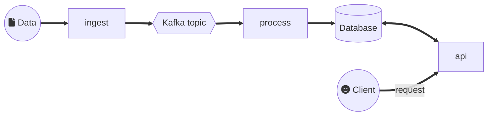

# Microservice

Here is an application that manages stocks data coming from a store.

## Goal

To build an application that indicates the current value of each stock.

### Business rules

Stock data are two-folds. There are:

* _observed stock_ indicating the new quantity of a product in the
  store.
* _delta_ indicating a variation in the stock (due to a sale or
  delivery) of a product.

Each time the application receives an _observed stock_ for a product,
the quantity _observed stock_ becomes the new reference quantity for
this product.

Each time the application receives a _delta_ for a product, the stored
quantity of this product is increased according to the quantity of the
_delta_ data.

### Constraints

* The application updates its data according to the received
  _observed stocks_ and _delta_.
* The application is scalable.
* The application is still available even in case of partial failure.

## About microservice architecture

Microservice architecture aims to build complex application with
guarantee in terms of resiliency and scalability.

Naturally, to bring complexity in an application is a nonsense.
Here, the application is complex, because it is divided into 3
separated and independent services, and it has a database and a queue.
Each of those items as a specific process in terms of delivery. You
have to monitor them all to check if they are always up. And the
services need to be synchronised not only at runtime, but also during
the development phase, because you have to ensure that the
communication will not fail and that they share the same data model.

The concession here is that if one of those items or services fails
(ie. the application partially fails), the rest of application continue
to run. And you can multiply the count of each item at delivery-time or
at runtime to increase the overall performance of the application (ie.
scalability).

### Application architecture

The application is divided into 3 services:

* `ingest`: get the data sent to an URL and push them to a Kafka topic.
* `process`: get the data from the Kafka topic, process them, and store 
  the result in the database.
* `api`: process requests sent by customers according to the data
  stored in the database.



The application contains a Kafka topic. This topic stores and
distributes input data to the process service.

There is a database. It serves as a storage of the state of the stock.
In this, it helps the process service to incrementally constitutes
stocks. The database also serves as a cache for the api service.

#### => Exercise

* Install and run Kafka in the VM
* Install and run Cassandra in the VM
* In the demo module, use the InitMain program to setup the required
  Kafka topic and the Cassandra table
* Install and run this application in the VM
* In the demo module, use the InjectorMain program to send data into
  the application
* Use your browser to query the api service

### Tolerance to partial failure

The whole application is resilient to partial failure.

* If `ingest` fails: process service get the last messages from the
  topic and stores last new data in database. The api works as usual.
  The requests of the client will be served, but, at the end, they
  will not have the last updates, according to the available data.
* If `process` fails: ingest service continues to send data to the
  topic. Depending on the frequency of new data, the size of the data,
  and the storage capacity of the Kafka cluster, the cluster will be
  able to store data coming from ingest service a long time. This time
  should be enough for you to detect the failure and to restart the
  process service. api service works as usual, but with no data update.
* If `api` fails: the chain ingest-process continues to work as usual.
  But the clients will have no response to their requests.
* If `Kafka` fails: the services ingest and process fail also. api
  service works as usual, with no data update.
* If `database` fails: the services process and api fail also. ingest
  service works as usual, with storage capacity of the Kafka cluster.

#### => Exercise

* Simulate partial failure by stopping some services in the application
  and see what is happening.
* Does the whole application works as usual, if you only restart the
  stopped services (without restarting the other running services)?

### Scalability

The application is scalable: by adding more instances of each service,
you can increase the performance of the application.

* If you add more instances of `process` services: the reason to do
  this is that you have more data to process from the Kafka topic. This
  means that the incoming data traffic at ingest service has increased,
  that you have increased the count of instances for ingest service and
  also that you have extended the Kafka cluster. It might be necessary
  to extend the Cassandra cluster.
* If you add more `ingest` services: the reason to do this is that have
  more incoming data. But if you add more ingest service, the client,
  who sends data, will need to deal with more addresses (ie. set of
  pairs host:port). In a view to expose only one address to such
  client, you can add a reverse proxy in front of ingest services.
  A _reverse proxy_ exposes only one address to an Internet client and
  can redistribute the client request to a set of services. In
  addition, this redistribution can be done by according to the load of
  each service. This is named _load balancing_. As an example,
  [Nginx](https://nginx.org/) and [HAProxy](http://www.haproxy.org/)
  provide reverse proxy and load balancing. In addition to all this,
  extending the Kafka cluster might be necessary. This is not the case
  for the process service.
* If you add more instances of `api` service, the application will be
  able to respond to more client requests. But to avoid the client to
  deal with more addresses, once again a reverse proxy will be
  necessary. More api instances also means more requests to the
  database. You should then extend the cluster of your database if it
  can scale (this is the case for Cassandra).

#### => Exercise

* Try to add instances of the process service (just run the service
  again). Does it receive messages from Kafka?
* Remove one of the instance of the process service. Do you lose
  data?

## Run it!

### Install Kafka & Cassandra

* [Apache Kafka](https://kafka.apache.org/)
* [Apache Cassandra](https://cassandra.apache.org/_/index.html)

Instructions

* Install Kafka (download the TGZ file and uncompress it — for windows,
  ensure that the Kafka directory is closed to the disk root and that
  there is no space and no character with accent)
* Launch Zookeeper:

```shell
$ ./bin/zookeeper-server-start.sh config/zookeeper.properties
```

* Launch Kafka:

```shell
$ ./bin/kafka-server-start.sh config/server.properties
```

* And a second instance:

```shell
$ ./bin/kafka-server-start.sh config/server.properties \
  --override broker.id=1 \
  --override log.dirs=/tmp/kafka-logs.1 \
  --override listeners=PLAINTEXT://:9093
```

Note for Windows: every scripts are under `bin\windows`. For example:

```shell
> bin\windows\zookeeper-server-start.bat config\zookeeper.properties
```

* Launch Cassandra (with Docker)

```shell
$ docker run -p 9042:9042 --name cassandra-db --rm cassandra:4.0.3
```

### Prepare Kafka & Cassandra

Simply run `InitMain` in the `demo` package with IntelliJ IDEA.

### Run the applications

With IntelliJ IDEA

1. Run `api.ApiMain`
1. Run `process.ProcessMain`
1. Run `ingest.IngestMain`

### Demo

On the ingest side, run `demo.InjectorMain`.

On the API side, try one of thoses URLs:

* http://localhost:10000/api/stocks/1
* http://localhost:10000/api/stocks/2
* http://localhost:10000/api/stocks/unknown
* http://localhost:10000/api/stocks

## Architecture

The architecture below shows the different parts of our application.
Each item between brackets (`[ABC]`) represents a microservice, which a
scalable unit of work. Each item between braces (`(Abc)`) represents
communication or a storage system.

Note: demo parts are here to simulate the behavior of an external user.

```
[demo/Injector]
    |
    | (HTTP)
    V
[INGEST]
    |
    | (Kafka)
    V
[PROCESS]
    |
    V
(Cassandra)
    |
    V
  [API]
    |
    | (HTTP)
    V
[demo/Reader]
```

## Reminder

* Always rely on memory model to process data, and not on whatever
  representation (String, JSON, binary...). Use those kinds of
  representation only for communication and storage, not for data
  processing.
